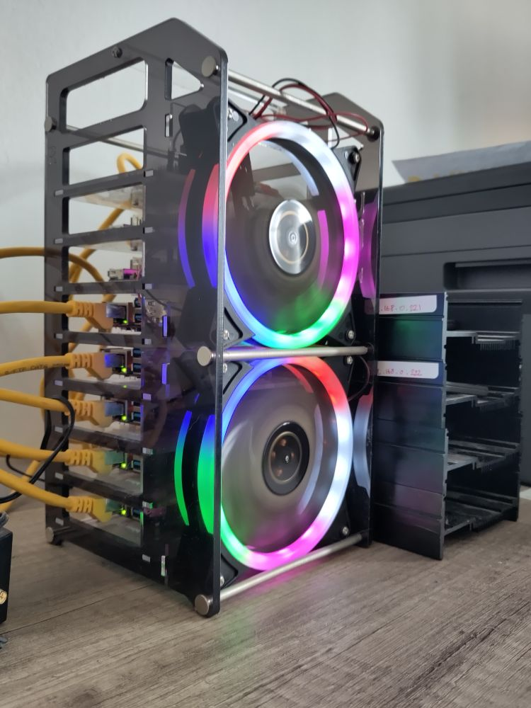
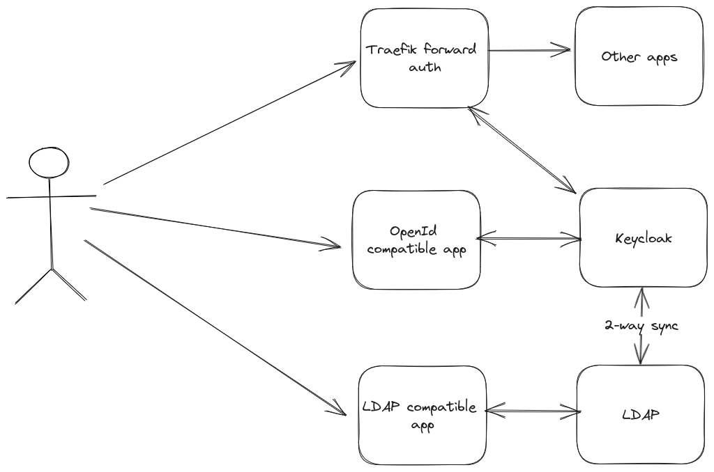

# Homelabitty

My Personal Homelab GitOps Repository

_... managed with Ansible, Terraform, Flux, Renovate and GitHub Actions_

## Hardware

| Device      | Count | OS Disk Size | Data Disk Size | Ram | Operating System    | Purpose             |
|-------------|-------|--------------|----------------|-----|---------------------|---------------------|
| Freebox     | 1     |              |                | 1GB | Freebox OS          | Fiber Modem         |
| Turris MOX  | 1     | 16GB (eMMC)  |                | 1GB | Turris OS (OpenWRT) | Router              |
| Rock64      | 3     | 64GB (eMMC)  |                | 4GB | Armbian             | Kubernetes Masters  |
| Orange PI 5 | 5     | 256GB (NVMe) |                | 8GB | Armbian             | Kubernetes Workers  |
| Odroid HC2  | 2     | 32GB (SD)    | 240 GB (SSD)   | 2GB | Armbian             | Postgresql Servers  |
| DS1520+     | 1     |              | 5x4TB          | 8GB | Synology OS         | NFS + Backup Server |

## Storage

- Local Data: https://longhorn.io/
- Media: NAS via NFS

## Auth

- IAM: https://www.keycloak.org/
- LDAP: https://github.com/lldap/lldap
- SSO: https://github.com/thomseddon/traefik-forward-auth

## Setup

[Here](docs/SETUP.md)

